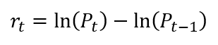
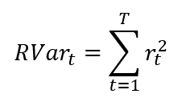
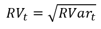
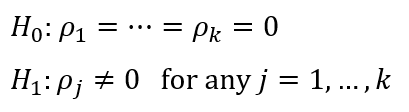

## This can be your internal website page / project page

**Project description:** This was a group research project I did as part of a financial econometrics course at the University of Sydney. As it was a group project, I worked with colleagues on this. The majority of the theoretical background research, stock data collection through the Bloomberg terminals as well as much of the financial analysis was done by my group mates. I did all of the coding, including the sentiment analysis and time series modelling. As such, I'll be focusing on that here. The inference was done together as a group but I'll go through that as well.

### 1. Introduction and Data Description

The goal of this project was to try to analyse the relationship between sentiment towards a company and the volatility of its stock price. More specifically, we wanted to see the effect that sentiment during the overnight period when the stock market is closed on the volatility at market open the next day. The example company here is Tesla, which is listed on the NASDAQ as *TSLA*. Tesla is a famously volatile stock so it should allow for some interesting analysis. This process, however, can be applied to any company.

To do this, we clearly need a few different pieces of information. First, we need a measure of volatility for TSLA stock as well as a benchmark to compare it against. Second, we need some covariates to avoid problems such as omitted variable bias, whereby information of an unseen variable is present in the variable of interest, which makes the variable of interest appear to have more explanatory power than it does in reality. Finally, we of course need some measure of sentiment towards Tesla.

For the measure of volatility, we decided on a metric called realised volatility. As volatility only shows variation at a single point in time, realised volatility allows us to measure the accumulated volatilty in a particular time frame. The calculation for this is shown later on. 

To calculate this, we needed financial data. We got this from Bloomberg terminals as this allowed us to get tick-by-tick data, i.e. a record of every transaction made. From here we got TSLA stock data for the first 30 mins of each day between 31 October 2018 and 30 April 2019. Unfortunately, the terminals didn't allow us to download data from earlier than 31 October, which limited the time frame of the analysis. The standard market index for the US stock market is the S&P500, so we used that as our benchmark and downloaded got S&P500 data for the same time frame.

For the second component we selected two covariates, *Press Release* and *Google Trends*. *Press Release* is a dummy variable of whether Tesla released a press report on that day, we chose this as company press releases, particularly after big events, are likely to influence public sentiment. *Google Trends* is a measure of Tesla's search engine popularity on each day, providing a good proxy for publc engagement with the company.

Finally, we need a measure of public sentiment towards Telsa. To calculate this, we analysed tweets that hashtagged Tesla and used a natural language processing technique called a sentiment analysis to determine if positive or negative language was used when referencing Tesla. The steps for this are shown below.

### 2. Twitter Scraping

To start off with I tried to use the Twitter API to scrape tweets. But I quickly found out that with the API you can only download tweets from the last week, which is a bit useless for this analysis. Luckily, I stumbled across a brilliant package called *GetOldTweets3*, which makes it very easy to scrape tweets from any time frame. Using this, I downloaded a year's worth of tweets with the hashtag *#tesla* - 338528 of them. Even though we've only got 6 months of financial data, having the whole year of tweets will let us draw some interesting insights later on. The code for this is below

```python
import pandas as pd
import numpy as np
import GetOldTweets3 as got3

tweet_criteria = got3.manager.TweetCriteria().setQuerySearch('#tesla').setSince("2018-05-01").setUntil("2018-05-02")
tweets_raw = pd.DataFrame(got3.manager.TweetManager.getTweets(tweet_criteria))

# extract the text and date of the tweet
tweets = pd.DataFrame(columns = ['text', 'date'])
tweets['text'] = tweets_raw[0].apply(lambda x: x.text)
tweets['date'] = tweets_raw[0].apply(lambda x: x.date)

# change tweet timezone from GMT to New York time where the NASDAQ is located
tweets = tweets.set_index('date')
tweets = tweets.tz_convert('US/Eastern')
```

### 3. Data Cleaning

With the tweets scraped, we now need to prepare them for the sentiment analysis. The first thing I checked for was Null value cells and duplicates. Duplicate tweets indicate that a bot has just spammed the same thing and are obviously going to distort the results of our sentiment analysis. 

```python
print(tweets.isna().sum())
tweets.describe()
```

Running this shows that there are no Null values but there are 13,280 duplicate tweets.

<span> | <span>
-------|-------:
count | 338528
unique | 325248
top | Install Nikola Tesla's Patents (https://buff.l...
freq | 690

We can delete them as follows:

```python
tweets = tweets.drop_duplicates()
```

Now we need to move on to cleaning up the text of the tweets themselves. Here I've written a function to remove non-punctuation characters '@' and '#', both of which are very common in tweets. This will help the sentiment analysis recognise the individual words better.

```python
def strip_charachters(string):
    for char in '@#':  
        string = string.replace(char,'')
    return string
tweets['stripped_text'] = tweets['text'].apply(strip_charachters)
```

After this, we need to remove all of the non-English tweets. In an ideal world, we'd have the tools to analyse all languages or perfectly translate the tweets to English to analyse them. But given that online translators often misinterpret text, the best option here is to only analyse English tweets. We can use a module called *langid* to identify the language of the tweets after which we can slice the dataframe to exclude all tweets in non-English language.

```python
import langid

tweets['language'] = tweets['stripped_text'].apply(langid.classify)
tweets['language'] = tweets['language'].apply(lambda x: x[0])
tweets = tweets[tweets['language'] == 'en']
tweets.head()
```

This process leaves us with a few superfluous columns so we remove them to leave just the tweet's text and the time it was posted. 

```python
tweets = tweets.drop(['text', 'language'], axis=1)
tweets.columns = ['text']
```

### 4. Sentiment Analysis 

There are a couple of ways to approach sentiment analysis. One way is with machine learning, which is how a lot of spam filters operate. However, this is quite hard without a labelled training set and the results are going to be a lot less accurate. Another approach is the use of a lexicon or dictionary where words are assigned a specific positivity/negativity. The caveat here is that the dictionary should be applicable to the context of the analysed text as people use language in different ways depending on the situation. As an example, using a lexicon of academic language to analyse tweets or Facebook posts is unlikely to give the desired results and vice versa, as the language used will be completely different. Again, I was lucky enough to find a rules-based approach to sentiment analysis, specifically created for social media posts.

The algorithm is called VADER Sentiment Analysis and has a convenient implementiation in the nltk natural language processing module in python. The way it works is that each word has been assigned a score between -4 and 4 on a scale from negative to neutral to positive. In addition, punction such as exclamation marks with strengthen the sentiment score given to a sentence. After the analysis each phrase/tweet receives a sentiment score between -1 and 1.

There was an academic paper (referenced below) written on the development of the algorithm that showed it produced very successful results. The implementation is as follows: 

```python
import nltk.sentiment.sentiment_analyzer import SentimentIntensityAnalyzer

analyser = SentimentIntensityAnalyzer()
scores = pd.DataFrame(tweets['text'].apply(analyser.polarity_scores))
for word in ['neg', 'neu', 'pos', 'compound']: 
    tweets[word] = [d[word] for idx, d in scores.text.items()]
daily_sentiment = tweets['compound'].groupby(pd.Grouper(freq='D')).mean()
```

Before we use the sentiment analysis for overnight period, it might be interesting to have a look at daily sentiment for the last year.

```python
import matplotlib.pyplot as plt

daily_sentiment1 = daily_sentiment*100
daily_sentiment1.plot(figsize=(16,5))
plt.title('Daily Twitter sentiment towards Tesla')
plt.hlines(0, xmin=min(daily_sentiment1.index), xmax=max(daily_sentiment1.index), linestyles='dashed')
plt.xlabel('Date')
plt.ylabel('Sentiment')

plt.show()
```


Overall, sentiment towards Tesla remains quite positive. There are however three noticeable dips. The three days where sentiment becomes negative are 19 June 2018, 27 September 2018, and 26 February 2019. If we search the news for Tesla on these dates we can find that all three coincide with some interesting events. 

First, on the 19<sup>th</sup> of June, it came out that an employee had allegedly sabotaged the Tesla factory by making large code changes to Tesla's manufacturing system and sending large amounts of highly sensitive data to thrid parties. Even more interestingly, on the 27<sup>th</sup> of September, Tesla shares dropped 13% in value after Elon Musk was charged with fraud by the SEC (US Securities and Exchnage Commission). Finally, on the 26<sup>th</sup> of February, Musk found himself again in trouble with SEC after they claimed that one of his tweets violated a settlement agreement and asked the courts to hold him in contempt.

Now, both Tesla's sentiment and stock price quickly recovered after these incidents, but it is interesting to see that there exists some connection between sentiment from hashtagged tweets and both news events and stock price movements. 

The function I've written below calculates the sentiment during the market close period for each day. The NASDAQ trades between 9:30 and 16:30 each business day. 

```python
def overnight_sentiment(data):
    time_1 = data.index.indexer_between_time('00:00:00', '9:30:00')
    morning = data.iloc[time_1]
    time_2 = data.index.indexer_between_time('16:30:00', '23:59:59')
    evening = data.iloc[time_2]
    
    sentiment = pd.DataFrame(morning['compound'].groupby(pd.Grouper(freq='D')).mean())
    sentiment.columns = ['morning']
    sentiment['evening'] = evening['compound'].groupby(pd.Grouper(freq='D')).mean()
    sentiment['day'] = (sentiment['morning'] + sentiment['evening'].shift())/2
    
    return sentiment
```

So, here I've had to take the evening sentiment from one day and average it with the morning sentiment of the next. For example, in order to calcluate overnight sentiment before the market opens on Wednesday 17 April 2019, I take mean sentiment from Tuesday 16:30-23:59 and from Wednesday 00:00-09:30 and average them. 

We combine this information with the realised volatility calculated in the next section.

### 5. Calculating Realised Volatility

Before moving on to the calculation of realised volatility, let's quickly go through what it is. As I mentioned before, volatility is a measure of variation at a specific point in time. Realised volatility, sums the volatility at each time point to measure the accumulated volatility in a certain time frame.

To calculate it, we first need to calculate the log return of the stock as follows:

    

Then realised variance is calculated by sum all of the squared log returns in the relevant time frame:



Finally, realised volatility is the square root of realised variance:



This process is implemented with the following function:

```python
def realised_volatility(data, end='10:00:00'):
     
    data.index = data['Dates']
    time = data.index.indexer_between_time('9:30:00', end)
    data = data.iloc[time]
    data = data.reset_index(drop=True)
    
    data['Previous_price'] = data['Price'].shift()
    data['Sq_log_return'] = np.log1p(data['Price']/data['Previous_price'])**2
    
    data.index = data['Dates']
    data = data.dropna().groupby(pd.Grouper(freq='D')).sum()
    data = data[data.index.dayofweek < 5] # select weekdays only
    data = np.sqrt(data['Sq_log_return'])
    data = data[data!=0]
    
    return data
```

Next we use the function to calculate realised volatility for both TSLA and the S&P500 the first 30 minutes of each business day. Sentiment is also calculated with the *overnight_sentiment* function written before. After that, we read in the data for the covariates and merge all of the data sets with inner joins. Finally, as sentiment is given as a score between -1 and 1, I've multiplied it by 100 so that the final result is slightly easier to interpret. 

```python
excel = pd.ExcelFile('Collated Opening 60.xlsx')
tsla_oct = pd.read_excel(excel, 'TSLA')
tsla_april = pd.read_excel(excel, 'TSLA Apr')
tsla_price = pd.concat([tsla_oct, tsla_april], axis=0)
tsla_price = tsla_price[['Dates', 'Price', 'Size']]

S_P_index = pd.read_excel(excel, 'S&P500')
S_P_index = S_P_index[['Dates', 'Price']]

tsla = realised_volatility(tsla_price)
S_P = realised_volatility(S_P_index)
overnight = overnight_sentiment(tweets)
overnight.index = overnight.index.strftime('%Y-%m-%d')
covariates = pd.read_excel('Covariates data.xlsx', index_col='Day')

reg_data = pd.merge(pd.DataFrame(tsla), pd.DataFrame(S_P), how='inner', left_index=True, right_index=True)
reg_data = pd.merge(reg_data, pd.DataFrame(overnight['day']), how='inner', left_index=True, right_index=True)
reg_data.columns = ['TSLA', 'S&P500', 'Sentiment']
reg_data = pd.merge(reg_data, covariates, how='inner', left_index=True, right_index=True)
reg_data['Sentiment'] = reg_data['Sentiment']*100
```

### 6. Model Estimation

Now we can move on to fitting the model. We can get a preliminary look at the difference between the realised volatility of TSLA and that of our benchmark, the S&P500, using the code below:

```python
months = ['Nov', 'Dec', 'Jan', 'Feb', 'Mar', 'Apr']

fig, ax = plt.subplots(1,1, figsize = [16,5])

ax.plot(y)
ax.set_title("Difference between the realised volatility of TSLA and S&P500 in the first 30 minutes of each day")
ax.set_ylabel("Realised volatility difference")
ax.set_xlabel("Date")
ax.set_xticks(ax.get_xticks()[::21])
ax.set_xticklabels(months)

plt.show()
```


The data has a slight upward trend. But before we get to that, we should test for autocorrelation.

We can check for autocorrelation using a Ljung-Box test. The Lgung-Box assumes a null hypothesis that the data is independently distributed, i.e. that there is not autocorrelation present. The alternative hypothesis is the data is not independently distributed and that it exibits autocorrelation. That is: 



Using the following code, I've run the test 20 times from lag of 1 to lag of 20.

```python
from statsmodels.stats.diagnostic import acorr_ljungbox

LB_test = acorr_ljungbox(y, lags=20)[1]

fig, ax = plt.subplots(1,1, figsize = [16,5])

ax.scatter(np.arange(1,21), LB_test, label = 'p-value')

ax.set_title("Ljung-Box Test Results")
ax.set_ylabel("Lag Order")
ax.set_ylabel("p-value")
ax.set_ylim([0,0.1])

ax.hlines(0.05, 0, 20, linestyles='dashed', label = 'alpha')
plt.legend()

plt.show()
```


The test quite clearly rejects the null hypothesis at all lags that the data is independent. Therefore, we have detected some autocorrelation, which indicates that some sort of autoregressive model could be used. To ARMA (autoregressive moving average) models, we need data that is stationary. We saw before that the time series has an upward trend and it looks as though it may exhibit some non-stationarity as the variance looks to be increasing with time. First, we can remove the linear trend by simply fitting a simple linear regression and subtracting the residuals.
 
```python
import statsmodels.api as sm

y = reg_data['TSLA'] - reg_data['S&P500']
X = np.arange(0, len(y))
X = sm.add_constant(X)
model = sm.OLS(y, X)
res = model.fit()
detrended_y = y - res.

fig, ax = plt.subplots(1,1, figsize = [16,5])

ax.plot(detrended_y)
ax.set_title("Difference between the realised volatility of TSLA and S&P500 in the first 30 minutes of each day")
ax.set_ylabel("Realised volatility difference")
ax.set_xlabel("Date")
ax.set_xticks(ax.get_xticks()[::21])
ax.set_xticklabels(months)

plt.show()
```


We can see that the data now exhibits the linear upward trend no more. The next thing to do is to test for non-stationarity. The test that allows us to do this is called the augmented Dickey-Fuller test. This tests the null hypothesis that the time series has a unit root, which is present if the autocorrelation equals 1. The time series is non-stationary in this case. The alternate hypothesis is that the time series is stationary.


```python
from statsmodels.tsa.stattools import adfuller

unit_root_test = adfuller(detrended_y)
unit_root_test[1]
```

With a p value of 0.0003 we reject the null hypothesis of the presence of a unit root. Thus, we can say that the series is stationary.

With these tests done, we are now ready to build our model. Here I am using the ARIMA model function from statsmodel's time series analysis package. The ARIMA model is made up of an autoregressive component, an integrated component (only necessary for non-stationary series), and an moving average component. As our series is stationary, the order of the integrated component is 0 and we are left with what is called an ARMA model. 

In order to find the optimal order of an ARMA model there are techniques that involve looking at the plots of the time series' autocorrelation function, but the most accurate way is just to fit models at a range of different orders and then choose the model that best fits the data. The following code performs this search.

```python
from statsmodels.tsa.arima_model import ARIMA

P = 3
Q = 2

aic = pd.DataFrame(0, index=['AR('+str(i).zfill(1)+')' for i in range(0,P)], 
                   columns=['MA('+str(i).zfill(1)+')' for i in range(0,Q)])

for p in range(0,P):
    for q in range(0,Q):
        y = detrended_y
        X = reg_data[['Sentiment', 'Press Release','Google trends']]
        model = ARIMA(endog=y, exog=X, order=(p,0,q))
        arma = model.fit(method='mle')
        aic.iloc[p,q] = round(arma.aic,3)     
aic
```

Order | MA(0)   | MA(1)
------|---------|-------
**AR(0)** | 967.350 | 963.332
**AR(1)** | 962.685	| 964.681
**AR(2)** | 964.676	| 966.433


```python
y = detrended_y 
X = reg_data[['Sentiment', 'Press Release','Google trends']]
model = ARIMA(endog=y, exog=X, order=(1,0,0))
armax = model.fit(method='mle')
print(arma`x.summary())
```


### 7. Inference and Analysis


